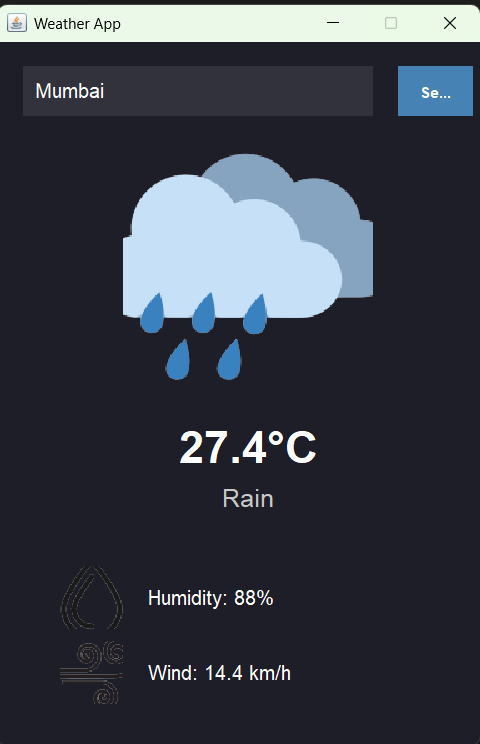

# Java GUI Weather App

A modern weather application built with Java Swing that fetches real-time weather data from APIs.

## APIs Used
- [Geolocation API: Geocoding](https://open-meteo.com/en/docs)
- [Weather API: Open-Meteo](https://open-meteo.com/en/docs)

## Images of our APP

## Features
- Real-time weather data
- Location-based weather search
- Temperature, humidity, and wind speed display
- Weather condition icons

